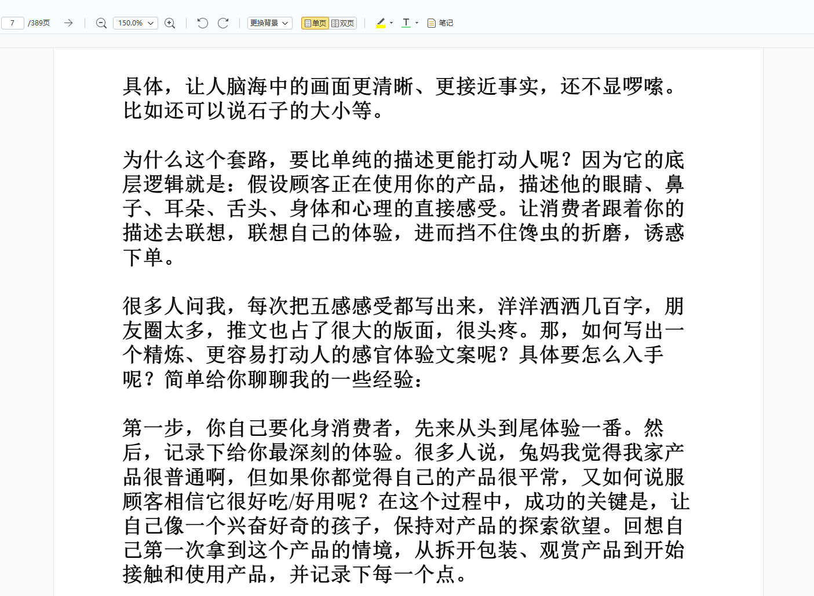

# 爬取知识星球，并制作成 PDF 电子书


## 功能

爬取知识星球的精华区，并制作成 PDF 电子书。

## 效果图



## 用法

首先安装必备的包（包里要求的其他连带的包会自动安装）：

```bash
pip install requests beautifulsoup4 pdfkit
```

安装 wkhtmltox，[https://wkhtmltopdf.org/downloads.html](https://wkhtmltopdf.org/downloads.html) 。安装后将安装目录下的 bin 目录加入到环境变量。这是用来制作 pdf 用的，可以将 html 格式转为 pdf 格式。

接下来请打开 `crawl.py` 文件，修改配置。

请先登录你有权限查看的星球的账号，进入该星球页面，请使用谷歌浏览器刷新页面，在 `Network` 面板的抓包内容中找到 `topics?...` 这样的请求，返回的是 `json` 内容。

将这个包的 `cookie` 部分复制到代码中 `headers` 部分的 `Cookie` 一栏，将这个请求的 `url`，域名为 `api.zsxq.com` 开头的，复制到代码中 `start_url` 的部分，注意，如果你只需要该星球星主的文章，这个网址一定要注意 `scope` 参数（该星球所有文章填写 `all`）：`topics?scope=by_owner&count=20`。然后代码再往下是批量获取该星球所有还是每过一段时间生成一个 pdf 文件，你可以自行选择修改调整。

完成后运行脚本即可：

```bash
python crawl.py
```

## 鸣谢

这个仓库最开始不是我弄的，鸣谢之前的作者，在他们的基础上我增加了许多防卡死的功能和日志输出，并且已调整成支持时间段获取了。该项目仅供学习交流使用，切莫用于商业用途！